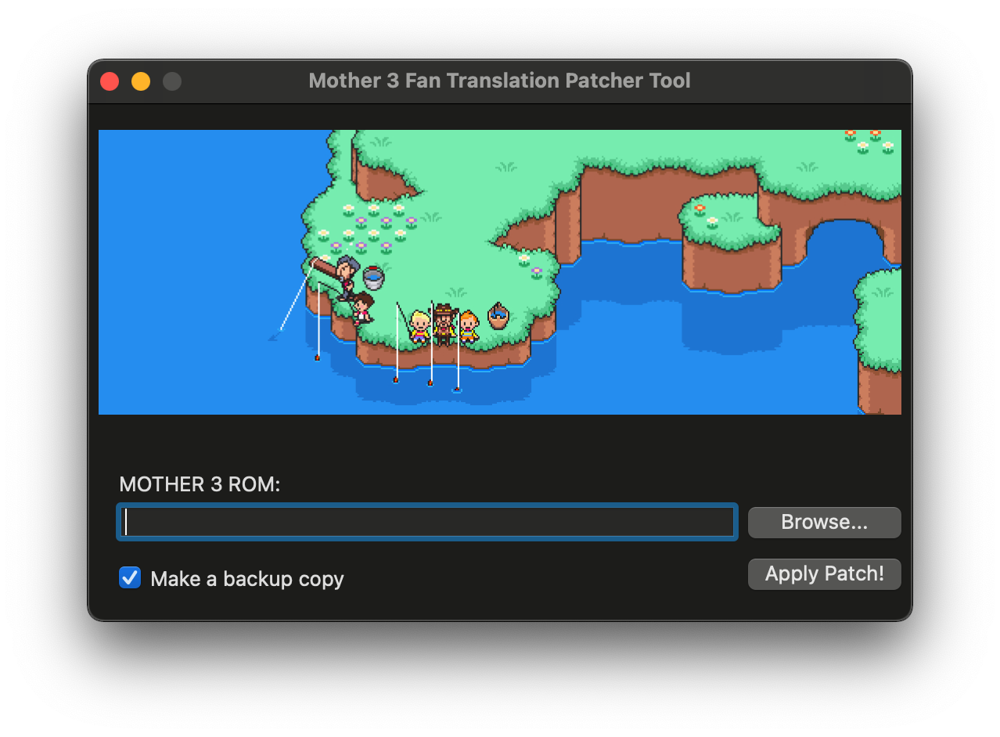

# Mother3Patcher
A GUI Mother 3 Fan Translation patcher for Windows and macOS. Inspired by Tomato and JeffMan's Mother 3 Fan Translation Patcher

## Information
As of right now, only the WPF design for the application has been completed, the program can't do anything yet as of right now.

## Why?
The Mac Mother 3 patcher no longer works on newer macOS versions and I decided to write a new patcher that is compactible with newer macOS versions and runs on a newer version of .NET Core so it no longer requires installing .NET Framework as a Windows feature.

## How to use
You will need to supply your own unpatched Mother 3 ROM file. I won't tell you where you can acquire that.

In the very hypothetical case that you have imported an original cartrige from Japan and used very specialized dumping hardware (read: a Nintendo DS), select your ROM file by clicking on the "Browse..." button. 

Make sure that you have "Make a backup copy" checked which will create a .bak version of the original ROM file. Then proceed with the patching by clicking "Apply Patch!".

As of right now this patcher wont check if your dump is bad. 

## Dependencies
You will need the .NET Core SDK
For macOS you will also need XCode.

## Acknowledgements
This patcher includes the [UPS patcher by rameshvarun](https://github.com/rameshvarun/ups) and the Mother 3 Fan Translation v1.4 by Clyde Mandelin and Jeffman. 

This project is not affiliated with Nintendo, 1-UP Studio, HAL Laboratories, Shigesato Itoi or the Mother 3 Fan Translation Project.
